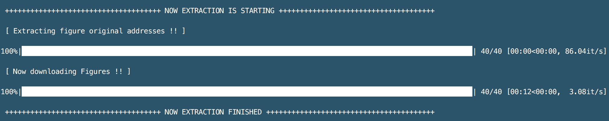

# <font size=6><br>_**gisdA.py</br></font> <font size=4>(Advanced Google Image Searching and Downloading)**_</font>

## <font color=white>_Feature_</font>
<font size=4>Let's <font color=grean><b>_Search_</b></font> and <font color=yellow><b>_Download_</b> </font>google images with <font color=red><b>_Keywords_ </b></font>!!</font>

## Description
+ Imaging searching python script using Google Engine
+ The script is very simple to use and useful for many purpose
+ Outputs are "_searched images with original resolution_" and their original links
+ The script supports <b>_python3_</b> and <b>_Chrome_
+ <font color=yellow>The script searches images from <b> _all scrolled pages_ </b></font>
+ _Progressbar_ is supporting in this version


## Install requirements
### &nbsp;&nbsp;&nbsp;_ChromeDriver_
&nbsp;&nbsp;&nbsp;&nbsp;You need to install [ChromeDriver](https://chromedriver.chromium.org/) to use this script.<br>
&nbsp;&nbsp;&nbsp;&nbsp;The installation instruction can be found [here](http://jonathansoma.com/lede/foundations-2018/classes/selenium/selenium-windows-install/).

### &nbsp;&nbsp;&nbsp;_Modules_
&nbsp;&nbsp;&nbsp;&nbsp;```pip setup.py install```

### &nbsp;&nbsp;&nbsp;_Before using this script_
##### &nbsp;&nbsp;&nbsp;You should input _'ChromeDriver'_ address in the following line of gisdA.py
&nbsp;&nbsp;&nbsp;```pathx = "your/chromeDriver/path"```

## Usage
+ <b>Run in Terminal</b>
```
python gisdA.py fMRI 65
```
+ <b>Help</b>
```
python gisdA.py --help
```

## Outputs
* <font size=4>_Downloaded searched images with original resolution_</font>


* <font size=4>_Links  of the searched images_</font>


## Version history
+ Version 0.1: the script release (2020.07.30)

## _Contact for Feedback and Bug Reports_
_Uksu, Choi (qtwing@naver.com)_
